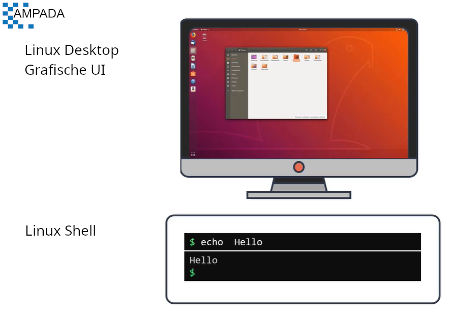
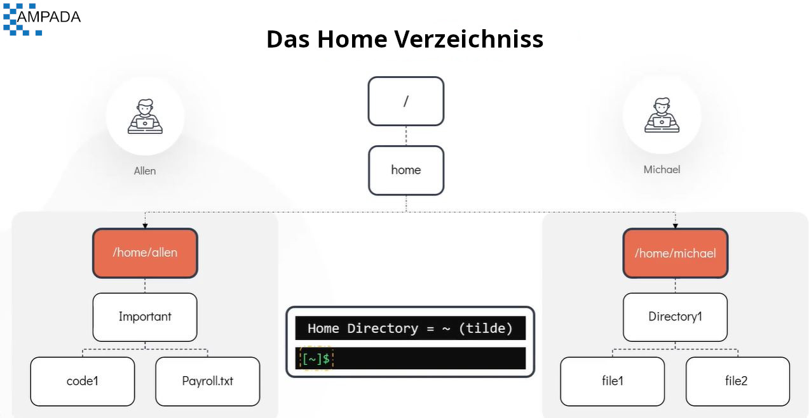
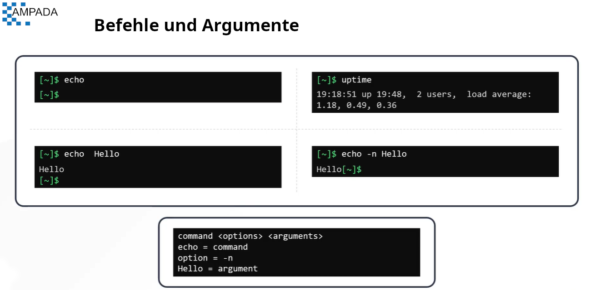

[HOME](../../README.md) | 01: Arbeiten mit der Shell - Teil 1 | 01: Einführung in die Shell
---

# Arbeiten mit der Shell - Teil 1

#### Linux Shell



- Die Befehlszeilenschnittstelle (CLI) ermöglicht es Ihnen, effektiv auf Linux-Laptops/-Servern/virtuellen Maschinen zu arbeiten.
- Während die grafische Version für die Benutzer ansprechender erscheinen mag, kann sie im Falle der Funktionalität eingeschränkt sein. Hier glänzt die allgemein als **`Linux Shell`** bekannte Linux-Befehlszeile.


  #### Was ist eine Shell?

 - Die Linux-Shell ist ein Programm, das eine textbasierte Interaktion zwischen dem Benutzer und dem Betriebssystem ermöglicht. Diese Interaktion wird ausgeführt, indem Befehle in die Schnittstelle eingegeben und die Antwort auf die gleiche Weise empfangen werden.
 - Die Linux-Shell ist ein leistungsstarkes Tool, mit dem Sie zwischen verschiedenen Orten innerhalb des Systems navigieren können. Wenn Sie sich jedoch bei der Shell anmelden, ist das allererste Verzeichnis, in das Sie gelangen, Ihr Home-Verzeichnis.

#### Das Home Verzeichnis



- Ein Benutzer-**`michael`**-Home-Verzeichnis, erstellt unter **`/home/michael`**, wobei **`/home`** ein vom System erstelltes Home-Verzeichnis ist, das die Home-Verzeichnisse für fast alle Benutzer des Linux-Systems enthält.
- Der Name des Heimatverzeichnisses ist standardmäßig identisch mit dem Namen des Benutzers, daher ist das Homeverzeichnis von **`michael`** **`/home/michael`**.
- Denken Sie daran, dass das Home-Verzeichnis für jeden Benutzer einzigartig ist. Ein anderer Benutzer namens **`allen`** hat ein anderes Home-Verzeichnis, das standardmäßig unter **`/home/allen`** erstellt wird.

  ##### Warum brauchen wir ein Home-Verzeichnis?
   - Das Home-Verzeichnis ermöglicht es Benutzern, ihre persönlichen Daten in Form von Dateien und Verzeichnissen zu speichern
   - Jeder Benutzer im System erhält sein eigenes einzigartiges Home-Verzeichnis mit vollständigem Zugriff darauf (um Daten speichern, abrufen und löschen zu können).
   - Betrachten Sie es als ein Ihnen zugewiesenes spezielles Schließfach, in dem Sie Gegenstände aufbewahren oder abrufen können.
   - Andere Benutzer können nicht auf Ihre Dateien und Ordner in Ihrem Home-Verzeichnis zugreifen (nur Sie können dies).

**Notiz** : Das Symbol für das Home Verzeichniss wird immer mit `~ (tilde symbol)` dargestellt.

#### Eingabeaufforderung

- Sie können die Eingabeaufforderung so konfigurieren, dass sie alles anzeigt, was Sie möchten, z. B. **`hostname`** , **`date`** oder **`time`**.
- Es ist derzeit so konfiguriert, dass es das aktuelle Arbeitsverzeichnis anzeigt. Das Symbol **`~`** repräsentiert hier das Home-Verzeichnis

#### Befehl und Argumente

- Um mit dem Linux-System über die Shell zu interagieren, muss ein Benutzer Befehle eingeben
- Wenn ein Befehl ausgeführt wird, führt er ein Programm aus, um eine bestimmte Aufgabe zu erfüllen.
   - **`Zum Beispiel`**: Der Befehl **`echo`** wird verwendet, um eine Textzeile auf dem Bildschirm zu drucken.
  ```
  $ echo
  ```
- Ein Argument fungiert als Eingabe für einen Befehl
   - **`Zum Beispiel`**: Um eine **`Hallo`**-Nachricht zu drucken, geben Sie den Befehl **`echo hello`** ein.
  ```
  $ echo hello
  ```
- Es gibt mehrere Befehle, die auch ohne Argument funktionieren können.
   - **`Zum Beispiel`**: Geben Sie den Befehl namens **`uptime`** ein, dieser wird verwendet, um Informationen darüber zu drucken, wie lange ein System seit dem letzten Neustart zusammen mit den anderen Informationen gelaufen ist (Dieser Befehl braucht kein Argument)
  ```
  $ uptime
  ```
- Ein Befehl kann auch Optionen haben, die sein Verhalten auf eine vorher festgelegte Weise modifizieren. Die Option wird manchmal auch als Schalter oder Flag bezeichnet
   - **`Zum Beispiel`**: Um das gleiche Wort "Hallo", aber ohne abschließende Zeile zu drucken, verwenden Sie den Befehl **`echo`** mit dem Flag **`-n`**.
  ```
  $ echo -n hello
  ```



#### Befehlstypen

Befehlstypen in Linux können allgemein in zwei Typen eingeteilt werden
  1. Interne oder eingebaute Befehle
     - Interne Befehle sind Teil der Shell selbst und werden mit dieser mitgeliefert, es gibt insgesamt etwa 30 solcher Befehle.
     - **`Zum Beispiel`**: echo, cd, pwd, set usw.
  1. Externe Befehle
     - Externe Befehle hingegen sind binäre Programme oder Skripte, die sich normalerweise in verschiedenen Dateien im System befinden. Sie werden entweder mit dem Paketmanager der Distribution vorinstalliert oder können vom Benutzer erstellt oder installiert werden
     - **`Zum Beispiel`**: mv, date, uptime, cp usw.

Um festzustellen, ob ein Befehl intern oder extern ist, verwenden Sie den Befehl **`type`**

```bash
[~]$ type echo
echo is a shell built-in
```

```bash
[~]$ type uptime
uptime is (/bin/uptime)
```

---
[BACK](../../README.md) | [NEXT](./02-Basis-Befehle.md)
