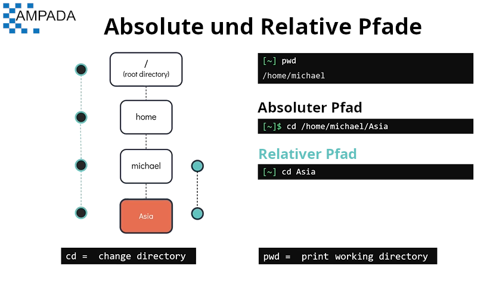
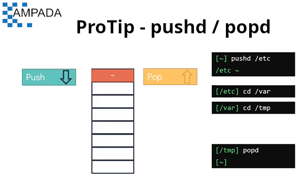
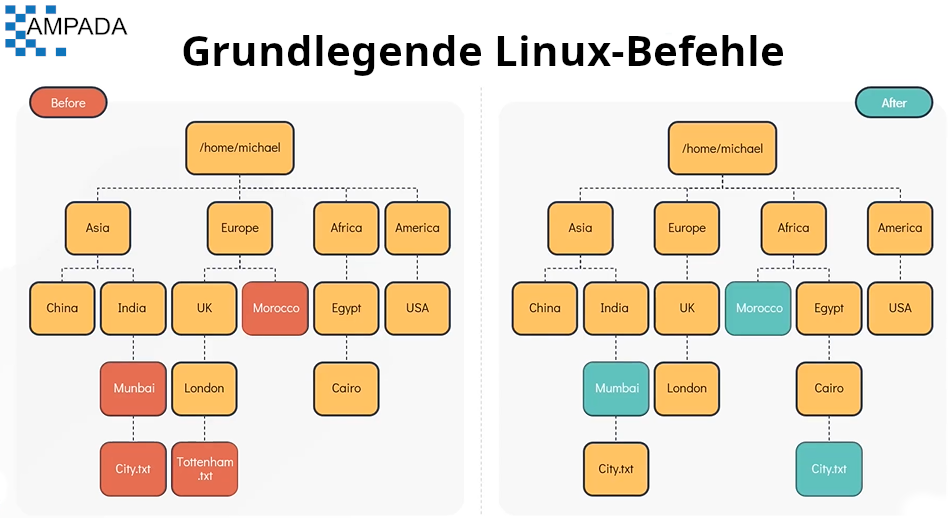

# Grundlegende Linux-Befehle

#### Unser Ziel ist es, eine Verzeichnisstruktur zu erstellen, wobei das oberste Verzeichnis **`/home/michael`** ist, das bereits als Home-Verzeichnis erstellt wurde, aber alles andere darunter muss erstellt werden.


Drucken des aktuellen Arbeitsverzeichnisses. Führen Sie den Befehl **`pwd`** aus
```
$ pwd
```

Um den Inhalt des Verzeichnisses anzuzeigen. Führen Sie den Befehl **`ls`** aus
```
$ ls
````

Ein Verzeichnis erstellen (oder) erstellen. Führen Sie den Befehl **`mkdir`** aus
```
$ mkdir Asien
```

Um mehrere Verzeichnisse zu erstellen (oder) zu erstellen. Führen Sie den Befehl **`mkdir`** gefolgt von **`<Verzeichnisname1> <Verzeichnisname2> .. <VerzeichnisnameN>`** aus
```
$ mkdir Europa Afrika Amerika
```

Zum Wechseln eines Verzeichnisses aus dem aktuellen Verzeichnis. Führen Sie **`cd <Verzeichnisname>`** aus
```
$ cd Asien
```

Zu rekursiv erstellten Verzeichnissen. Führen Sie **`mkdir -p <Verzeichnisname1>/<Unterverzeichnis_von_Name1>`** aus
```
$ mkdir -p Indien/Mumbai
```

Zurück zu einem Verzeichnis nach oben. Führen Sie **`cd ..`** aus
```
$ cd ..
```

Um von jedem Ort im System direkt zu einem Home-Verzeichnis des aktuellen Benutzers zurückzukehren. Führen Sie **`cd`** aus
```
$ cd
```

#### Betrachten wir nun den absoluten Pfad und den relativen Pfad



**Unterschied zwischen absolutem und relativem Pfad**

- **Absoluter Pfad** : Ein absoluter Pfad ist so definiert, dass er den Speicherort einer Datei oder eines Verzeichnisses aus dem Stammverzeichnis (/) angibt.
- **Relativer Pfad** : Der relative Pfad ist definiert als der Pfad, der sich direkt auf die aktuelle Arbeit bezieht (pwd).

In ein Verzeichnis mit absolutem Pfad wechseln. Führen Sie **`cd <Verzeichnispfad>`** aus
```
$ cd /home/michael
```

In ein Verzeichnis mit relativem Pfad wechseln. Führen Sie **`cd <Verzeichnisname>`** aus
```
$ cd Asien
```

#### Werfen wir nun einen Blick auf Alternativen zum Befehl **`cd`**



Eine Alternative zum **`cd`** ist der Befehl **`pushd\popd`**. Um das Verzeichnis mit pushd zu wechseln, führen Sie **`pushd <directory_name>`** aus.
```
$pushd /etc
```

Sie können beliebig oft in Unterverzeichnisse unter /etc wechseln
```
$ pushd /var
$pushd /tmp
$ pwd
/etc/var/tmp
```

Um zum Ursprungsverzeichnis (z. B. Ihrem Home-Verzeichnis) zurückzukehren, verwenden Sie den Befehl **`popd`**
```
$ popd
```

#### Lassen Sie uns nun weitergehen, um einige grundlegendere Befehle in Linux zu betrachten. Um diese Befehle zu lernen, verwenden wir dieselbe Verzeichnisstruktur wie zuvor, jedoch wurden jetzt einige neue Dateien und Verzeichnisse hinzugefügt, wie im Diagramm gezeigt. Das Ziel dieser Aufgabe ist sicherzustellen, dass die Verzeichnisstruktur wie im folgenden Diagramm aussieht.



Datei oder Verzeichnis verschieben. Führen Sie den Befehl **`mv <source> <destination>`** aus
```
$ mv /home/michael/Europe/Marocco /home/michael/Africa/ (Absoluter Pfad)
$ mv Europa/Marokko Afrika/ (Relativer Pfad)
```

Um ein Verzeichnis umzubenennen. Führen Sie den Befehl **`mv <oldname> <newname>`** aus
```
$ mv Asien/Indien/Munbai Asien/Indien/Mumbai
```

Um eine Datei in ein Verzeichnis zu kopieren. Führen Sie den Befehl **`cp <Dateiname> <Pfad des Zielverzeichnisses>`** aus
```
$ cp Asien/Indien/Mumbai/City.txt Afrika/Ägypten/Kairo
```

So löschen Sie eine Datei aus einem Verzeichnis. Führen Sie den Befehl **`rm /path/<filename>`** aus
```
$ rm Europe/UK/London/Tottenham.txt
```

Um ein Verzeichnis rekursiv zu kopieren. Führen Sie den Befehl **`cp -r <Quellpfad> <Zielpfad>`** aus
```
$ cp -r Europa/Großbritannien Europa/Großbritannien
```

Den Inhalt einer Datei drucken. Führen Sie den Befehl **`cat /path/to/<filename>`** aus
```
$ cat Asien/Indien/Mumbai/City.txt
```

So fügen Sie mit cat(redirect) einen Inhalt zu einer Datei hinzu. Führen Sie den Befehl **`cat > /path/to/<filename>`** aus
```
$ cat > Africa/Egypt/Cairo/City.txt
   Kairo
   `Strg + d auf der Tastatur eingeben`
```

Um eine leere Datei zu erstellen. Führen Sie den Befehl **`touch /path/to/filename`** aus
```
$ touch /home/michael/Asia/China/Country.txt
```

Um den Inhalt einer Datei scrollbar anzuzeigen. Führen Sie den Befehl **`more /path/to/filename`** aus <-- nicht empfohlen für große Dateien
```
$ less Country.txt
```

Um den Inhalt einer Datei anzuzeigen und durch die Datei zu navigieren. Führen Sie den Befehl **`less /path/to/filename`** aus
```
$ less neue_datei.txt
```

Um die lange Liste von Dateien und Verzeichnissen zu erhalten. Führen Sie den Befehl **`ls -l`** aus
```
$ls -l
```

Um alle Dateien einschließlich der versteckten aufzulisten. Führen Sie den Befehl **`ls -la`** aus
```
$ls -a
```

Listet alle Dateien in der Reihenfolge auf, in der sie geändert wurden. Führen Sie den Befehl **`ls -lt`** aus
```
$ls -lt
```

Zum Auflisten aller Dateien von der ältesten bis zur neuesten. Führen Sie den Befehl **`ls -ltr`** aus
```
$ ls -ltr
```
