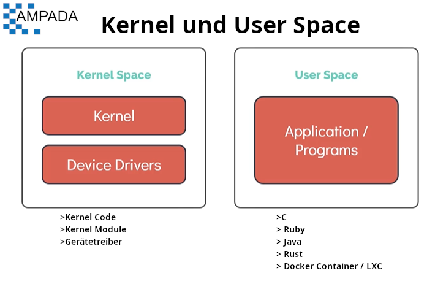

[HOME](../../README.md) | 02: Linux Core Konzepte | 01: Der Linux Kernel
---
# Linux Core Konzepte

## Der Linux Kernel

#### Wenn Sie mit irgendeinem Betriebssystem gearbeitet haben, ist Ihnen der Begriff Kernel begegnet.

- Der Linux-Kernel ist monolithisch, das heißt, der Kernel führt CPU-Scheduling, Speicherverwaltung und verschiedene Operationen selbst durch.
- Der Linux-Kernel ist ebenfalls modular, was bedeutet, dass er seine Fähigkeiten durch die Verwendung dynamisch geladener Kernel-Module erweitern kann

   

#### Der Kernel ist für 4 Hauptaufgaben verantwortlich

1. Speicherverwaltung
1. Prozessmanagement
1. Gerätetreiber
1. Systemaufrufe und Sicherheit

## Linux-Kernel-Versionen

#### Lassen Sie uns wissen, wie Sie Linux-Kernel-Versionen identifizieren können

Verwenden Sie den **`uname`**-Befehl, um Informationen über den Kernel zu erhalten (an sich liefert er nicht viele Informationen, außer dass das System den **`Linux`**-Kernel verwendet.
```
$ uname
```

Verwenden Sie den **`uname -r`** oder **`uname`** Befehl und die Option, um die Kernel-Version zu drucken
```
$ uname -r
$ uname -a
```
   

## Kernel und Benutzerbereich

#### Eine der wichtigsten Funktionen des Linux-Kernels ist die **`Speicherverwaltung`** . Wir werden nun sehen, wie der Speicher innerhalb des Linux-Kernels getrennt wird

Das Gedächtnis ist in zwei Bereiche unterteilt.
1. Kernel-Space
    1. Kernel-Code
    1. Kernel-Erweiterungen
    1. Gerätetreiber
1. Benutzerbereich
    1. C
    1. Java
    1. Python
    1. Rubin usw
    1. Docker-Container



#### Lassen Sie uns wissen, wie Programme, die im `User Space` laufen, funktionieren

Alle Benutzerprogramme funktionieren, indem sie Daten manipulieren, die im Speicher und auf der Festplatte gespeichert sind. Benutzerprogramme erhalten Zugriff auf Daten, indem sie eine spezielle Anfrage an den Kernel namens **`System Calls`** stellen.
- Beispiele hierfür sind das Zuweisen von Speicher mithilfe von Variablen oder das Öffnen einer Datei.

  

- Wenn Sie beispielsweise eine Datei wie **`/etc/os-release`** öffnen, um das installierte Betriebssystem anzuzeigen, führt dies zu einem **`Systemaufruf`**

   
---
[BACK](../01-Arbeiten-mit-der-Shell-Teil-1/06-Lab-Linux-Bash-Shell.md) | [NEXT](./02-Arbeiten-mit-der-Hardware.md)
