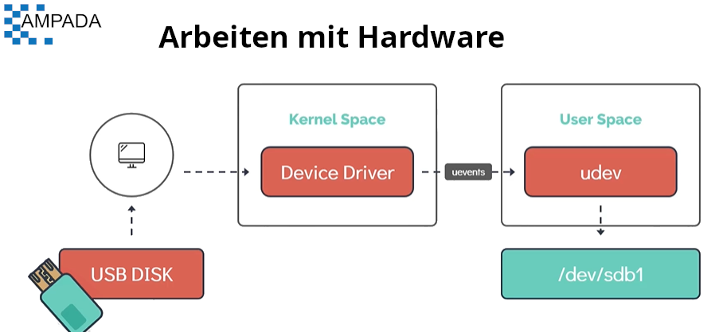
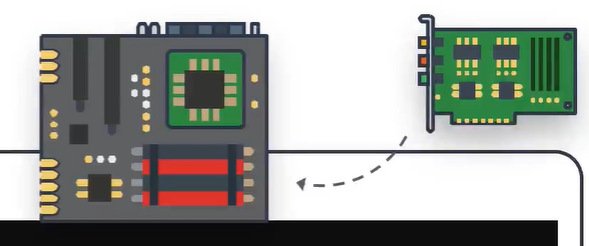

# Arbeiten mit Hardware

In diesem Abschnitt werden wir uns ansehen, wie Linux mit den für das System verfügbaren Hardwareressourcen arbeitet und wie Kernelmodule verwendet werden.
- Wir werden uns ansehen, wie Linux an das System angeschlossene Hardwaregeräte identifiziert und verwaltet.
- Wir werden dann Möglichkeiten sehen, diese Geräte aufzulisten und detaillierte Informationen über die Befehlszeile zu erhalten.

Nehmen wir ein Beispiel für **`USB Disk`**, das im System verwendet wird.
- Sobald das **`USB-Gerät`** an das System angeschlossen wird, erkennt ein entsprechender Gerätetreiber, der Teil des Kernelspace ist, den Stufenwechsel und generiert ein Ereignis.
- Dieses Ereignis namens **`uevents`** wird dann an den **`User Space`**-Gerätemanager-Daemon namens **`udev`** gesendet.
- Der Dienst **`udev`** ist dann für die dynamische Erstellung eines Geräteknotens verantwortlich, der dem neu angeschlossenen USB-Laufwerk im Dateisystem **`/dev/`** zugeordnet ist.
- Sobald der Vorgang abgeschlossen ist, sollte die neu angeschlossene Festplatte im Dateisystem **`/dev/`** sichtbar sein.



Verwenden Sie **`dmesg`**, um Nachrichten aus dem Bereich des Kernels namens **`Ring Buffer`** anzuzeigen. Beim Hochfahren eines Linux-Betriebssystems wurden zahlreiche vom Kernel generierte Meldungen auf dem Bildschirm angezeigt. Diese Nachrichten enthalten auch Protokolle von den Hardwaregeräten, die der Kernel erkennt, und geben einen guten Hinweis darauf, ob er in der Lage ist, ihn zu konfigurieren
```
$ dmesg
$dmesg | grep -i usb
```

**`udevadm`** ist das Verwaltungsdienstprogramm für udev, das die Datenbank nach Geräteinformationen abfragt.
```
$ udevadm info --query=Pfad --name=/dev/sda5
```

Der **`udevadm-Monitor`** hört auf die neuen **`uevents`** des Kernels, wenn er ein Ereignis erkennt, und gibt Details wie den **`Gerätepfad`** und den **`Gerätenamen`* aus * auf dem Bildschirm. Dieser Befehl ist praktisch, um die Details des neu angeschlossenen oder entfernten Geräts zu ermitteln.
```
$ udevadm-Monitor
```

Listet alle im System konfigurierten PCI-Geräte (Peripheral Component Interconnect) auf. Beispiele für PCI-Geräte sind **`Ethernetkarten`**, **`RAID-Controller`**, **`Videokarten`** und **`Wireless-Adapter`**, die direkt an PCI-Steckplätze im Motherboard angeschlossen sind der Computer
```
$lspci
```
    


So listen Sie Informationen zu **`Geräten blockieren`** auf
```
$ lsblk
```
    


Zum Anzeigen von Detailinformationen über die **`CPU`** wie CPU-Architektur, CPU-Betriebsmodi (32 Bit, 64 Bit) usw.
```
$ lscpu
```

Zum Auflisten des verfügbaren Speichers im System.
```
$ lsmem --Zusammenfassung
```

Ein weiterer alternativer Befehl, um die Informationen über den Speicher anzuzeigen. Dieser Befehl listet den gesamten belegten und freien Speicher auf.
```
$ frei -m
```

Um Detailinformationen über die gesamten Hardwareinformationen der Maschine zu extrahieren
```
$ lshw
```

#### Um Befehle mit Root-Rechten auszuführen. Nicht jeder Benutzer kann alle Befehle im Linux-System ausführen, einige Befehle müssen als `root` oder `super-user` ausgeführt werden. Verwenden Sie **`sudo`** gefolgt von <command> (geben Sie das sudo-Passwort ein).

```
$ sudo lshw
```
