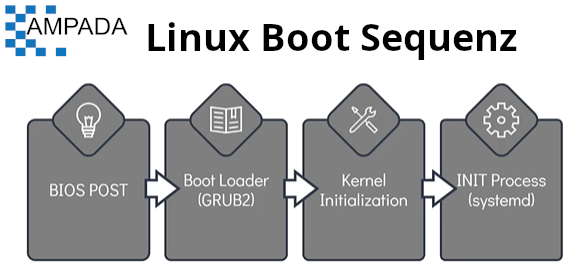
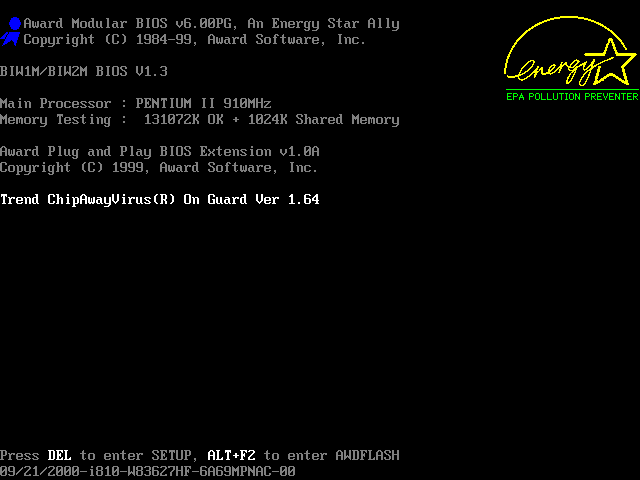
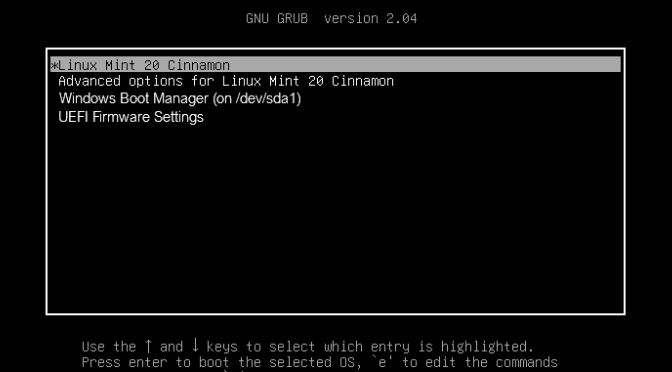
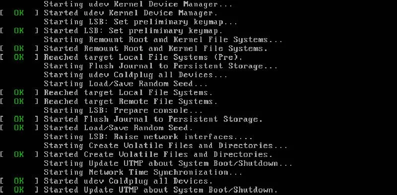

[HOME](../../README.md) | 02: Linux Core Konzepte | 04: Linux Boot Sequenz
---
# Linux-Boot-Sequenz

In diesem Abschnitt betrachten wir den Bootvorgang vereinfacht, indem wir ihn in vier größere Schritte unterteilen.
- Der Bootvorgang kann in vier Phasen unterteilt werden
   1. BIOS-POST
   1. Bootloader (GRUB2)
   1. Kernel-Initialisierung
   1. INIT-Prozess

   

  #### Wie starte ich einen Linux-Startvorgang?
   - Dies kann auf eine der beiden Arten erreicht werden.
     - Die erste Methode besteht darin, ein Linux-Gerät zu starten, das sich in einem angehaltenen oder gestoppten Zustand befindet
     - Die zweite Methode besteht darin, ein laufendes System neu zu starten oder zurückzusetzen

  #### BIOS-POST

  - Die erste Phase namens **`BIOS POST`** hat sehr wenig mit Linux selbst zu tun.
  - **`POST`** steht für **`Power On Self Test`**.
  - In dieser Phase führt das BIOS einen POST-Test durch, um sicherzustellen, dass die an das Gerät angeschlossenen Hardwarekomponenten ordnungsgemäß funktionieren. Wenn der POST fehlschlägt, ist der Computer möglicherweise nicht betriebsbereit und das System fährt nicht mit der nächsten Phase des Startvorgangs fort

  

  #### Bootloader
  - Die nächste Stufe nach dem BIOS-POST ist **`Boot Loader`** nach erfolgreichem POST-Test.
  - Das BIOS lädt und führt den Boot-Code vom Boot-Gerät aus, das sich im ersten Sektor der Festplatte befindet. Unter Linux befindet sich dieser im Dateisystem **`/boot`**.
  - Der Bootloader stellt dem Benutzer den Boot-Bildschirm zur Verfügung, oft mit mehreren Optionen zum Booten. Wie Microsoft Windows OS oder Ubuntu 22.04 OS in einem Beispiel eines Dual-Boot-Systems.
  - Sobald die Auswahl auf dem Boot-Bildschirm getroffen wurde, lädt der Boot-Lader den Kernel in den Speicher, versorgt ihn mit einigen Parametern und übergibt die Kontrolle an den Kernel
  - Ein beliebtes Beispiel für den Bootloader ist **`GRUB2`** (GRand Unified Bootloader Version 2). Es ist jetzt ein primärer Bootloader für die meisten Betriebssysteme.

  

  #### Kernel-Initialisierung
  - Nachdem der Kernel ausgewählt und in den Speicher geladen wurde, wird dieser normalerweise dekomprimiert und dann in den Speicher geladen.
  - In dieser Phase führt der Kernel unter anderem Aufgaben wie die Initialisierung der Hardware und Speicherverwaltungsaufgaben aus.
  - Sobald es vollständig betriebsbereit ist, sucht der Kernel nach **`INIT Process`**, um ausgeführt zu werden. Was den **`User Space`** einrichtet und der Prozess für die Umgebung benötigt wird.

  

  #### INIT-Prozess

  - In den meisten aktuellen Linux-Distributionen ruft die **`INIT`**-Funktion dann den **`systemd`**-Daemon auf.
  - Der **`systemd`** ist dafür verantwortlich, den Linux-Host in einen benutzbaren Zustand zu bringen.
  - **`systemd`** ist verantwortlich für das Mounten der Dateisysteme, das Starten und Verwalten von Systemdiensten.
  - **`systemd`** ist heutzutage der universelle Standard, aber vor nicht allzu langer Zeit wurde ein anderer Initialisierungsprozess namens **`system V (five) init`** verwendet. Es wird auch **`Sys5` genannt
    - Diese wurden beispielsweise in **`RHEL 6`**- oder **`CentOS 6`**-Distributionen verwendet
  - Einer der Hauptvorteile der Verwendung von **`systemd`** gegenüber **`system V(five) init`** ist, dass es die Systemstartzeit verkürzt, indem es den Start von Diensten parallelisiert.

  Um das verwendete **`init`**-System zu überprüfen, führen Sie **`ls -l /sbin/init`** aus, wenn es systemd ist, sehen Sie eine Verknüpfung auf **`/lib/systemd/systemd`**
  ```
  $ ls -l /sbin/init
  ```
---
[BACK](./04-Lab-Linux-Kernel.md) | [NEXT](./05-Runlevels.md)
