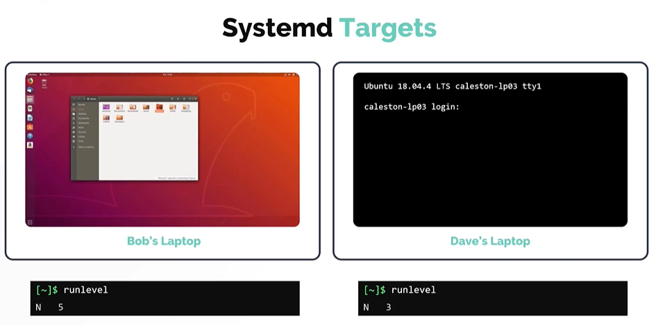
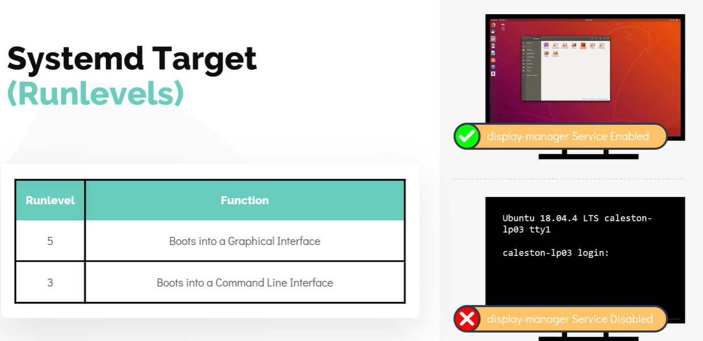
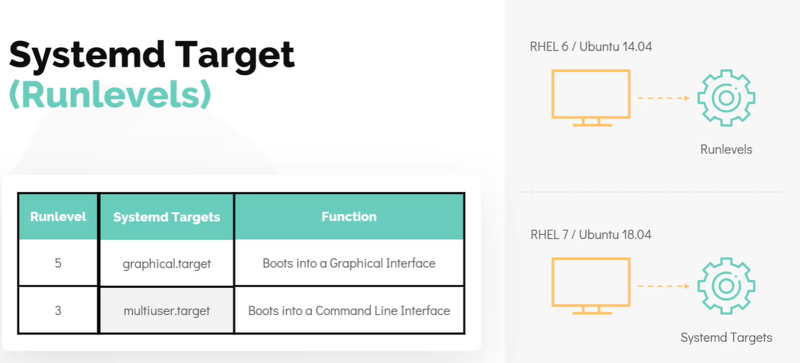

[HOME](../../README.md) | 02: Linux Core Konzepte | 05: RunLevels
---
# Run-Levels

## Systemd-Ziele (Runlevels)

Wir können den Server so einrichten, dass er entweder im grafischen Modus oder im nicht-grafischen Modus startet. Linux kann in mehreren Modi laufen und diese Modi werden durch etwas namens **`Runlevel`** festgelegt
- Der Betriebsmodus, der eine grafische Oberfläche bietet, heißt **`Runlevel 5`**
- Der Betriebsmodus, der einen nicht-grafischen Modus bietet, heißt **`Runlevel 3`**

    

Um den im System ausgeführten Betriebsmodus anzuzeigen. Führen Sie im Terminal den Befehl **`runlevel`** aus
```
$ runlevel
```

Während des Bootens überprüft der **`init`**-Prozess den **`Runlevel`**, er stellt sicher, dass alle Programme, die den Systembetrieb in diesem Modus erhalten müssen, gestartet werden.
   - Zum Beispiel: Der **`Graphical User`**-Modus erfordert einen **`Display Manager`**-Dienst, damit die GUI funktioniert, aber dieser Dienst ist für den **`non-graphical mode`* nicht erforderlich *

     

Im Abschnitt zum Bootvorgang haben wir gesehen, dass **`systemd`** in den meisten neuen Linux-Distributionen wie **`Ubuntu 18.04`** als **`init`**-Prozess verwendet wird.
- In **`systemd`** werden Runlevels als **`Ziele`** aufgerufen.
   - Der RunLevel 5 wird als **`graphical Ziel`** aufgerufen
   - Der Runlevel 3 wird als **`multiuser target`** aufgerufen

     

#### Nun, da wir mit Runlevels in der Systemd-Zieleinheit vertraut sind. Schauen wir uns nun an, wie wir diese Werte von einer Shell aus ändern.

Um das Standardziel anzuzeigen, führen Sie den Befehl **`systemctl get-default`** aus. Dieser Befehl sieht sich die Datei an, die sich unter **`/etc/systemd/system/default.target`** befindet.
```
$ systemctl get-default
```

Um das Standardziel zu ändern, können wir **`systemctl set-target <gewünschter Zielname geht hier als Argument>`** verwenden.
```
$ systemctl set-default multi-user.target
```
---
[BACK](./04-Linux-Boot-Sequenz.md) | [NEXT](./06-Filetypen.md)
