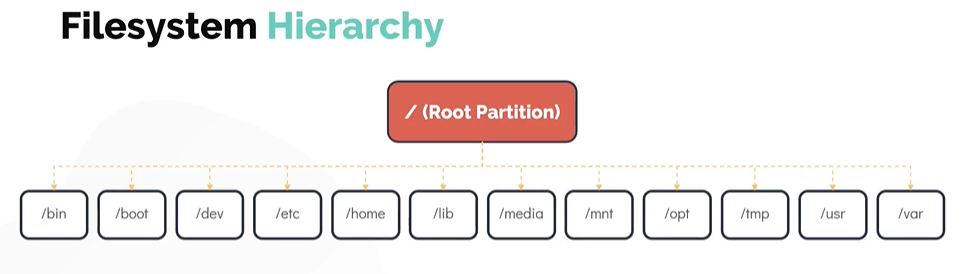

[HOME](../../README.md) | 02: Linux Core Konzepte | 07: Dateisystemhierarchie
---
# Dateisystemhierarchie

In diesem Abschnitt werfen wir einen Blick auf die **`Dateisystemhierarchie`**
- Linux verwendet ein einzeln verwurzeltes, invertiertes baumartiges Dateisystem
   - **`/home`** : Dies ist der Speicherort, der die Home-Verzeichnisse für alle Benutzer enthält, mit Ausnahme des Benutzers **`root`** (das Home-Verzeichnis des Root-Benutzers befindet sich unter **`/root`**)
   - **`/opt`** : Wenn Sie Programme von Drittanbietern installieren möchten, legen Sie diese im Dateisystem **`/opt`** ab.
   - **`/mnt`** : Dies ist der Standard-Einhängepunkt für jede Partition und standardmäßig leer. Es wird verwendet, um Dateisysteme temporär im System einzuhängen
   - **`/tmp`** : Es wird verwendet, um temporäre Daten zu speichern
   - **`/media`** : Alle externen Medien sind auf **`/media`** gemountet
   - **`/dev`** : Enthält die speziellen Block- und Zeichengerätedateien
   - **`/bin`** : Die grundlegenden Programme wie Binaries **`cp`**, **`mv`**, **`mkdir`** befinden sich im Ordner **`/bin`* * Verzeichnis
   - **`/etc`** : Es speichert die meisten Konfigurationsdateien in Linux.
   - **`/lib`** : Das Verzeichnis **`/lib`** und **`/lib64`** ist der Ort, an dem Sie nach gemeinsam genutzten Bibliotheken suchen können, die in Ihr Programm importiert werden sollen
   - **`/usr`** : In älteren Systemen wird das Verzeichnis **`/usr`** für **`User Home Directories`** verwendet, in den modernen Linux-Betriebssystemen ist es jedoch der Ort, an dem alle Benutzeranwendungen, Dokumentationen und andere geteilte Daten.
   - **`/var`** : Enthält variable Daten wie Mails, Protokolldateien

       

  Um alle gemounteten Dateisysteme zu drucken, führen Sie den Befehl **`df`** (Disk Filesystem) aus
  ```
  $ df-hP
  ```
---
[BACK](./06-Filetypen.md) | [NEXT](../03-Paket-Mangement/01-Paket-Management-Distributionen.md)
