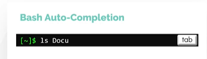
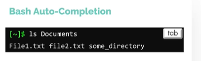
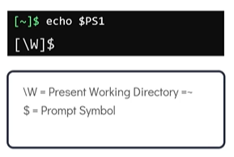
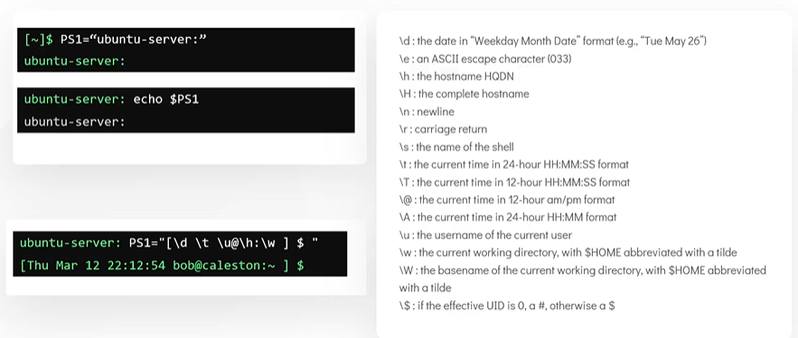

# Bash-Shell

## Verschiedene Arten von Shell

In diesem Abschnitt werden wir uns verschiedene Arten von Shells ansehen.
- Es gibt verschiedene Arten von Shells in Linux, einige der beliebtesten sind unten aufgeführt
   - Bourne-Shell (sh)
   - C-Shell (csh oder tsh)
   - Korn Shell (ksh)
   - Z-Shell (zsh)
   - Bourne Again-Shell (Bash)

Um die verwendete Shell zu überprüfen. Verwenden Sie den Befehl **`echo $SHELL`**
```
$echo $SHELL
```

So ändern Sie die Standard-Shell. Verwenden Sie den Befehl chsh, Sie werden nach dem Passwort gefragt und geben anschließend den Namen der neuen Shell ein. Sie müssen sich jedoch bei einer neuen Terminalsitzung anmelden, um diese Änderung zu sehen.
```
$chsh
```

## Bash-Shell-Funktionen

1. Bash unterstützt die automatische Vervollständigung von Befehlen. Dies bedeutet, dass bash Befehle für Sie automatisch vervollständigt, wenn Sie einen Teil davon eingeben und die **`Tab`**-Taste drücken

    

    

1. In Bash können wir benutzerdefinierte Aliase für die eigentlichen Befehle festlegen
    ```
    $ date
    $ alias dt=date
    $ dt
    ```
1. Verwenden Sie den Befehl **`history`**, um die vorherigen Ausführungsbefehle aufzulisten, die Sie zuvor ausgeführt haben
    ```
    $ history
    ```

  ## Bash-Umgebungsvariablen

  Umgebungsvariable **`SHELL`** drucken
  ```
  $echo $SHELL
  ```

  Um eine Liste aller Umgebungsvariablen anzuzeigen. Führen Sie **`env`** vom Terminal aus
  ```
  $ env
  ```

  Um eine Umgebungsvariable mit in der Shell zu setzen. Der Wert wird nicht auf andere Prozesse übertragen.
  ```
  $ OFFICE=Koeln
  ```

  Um eine Umgebungsvariable festzulegen, können wir den Befehl **`export`** verwenden. Um den Wert auf einen anderen Prozess zu übertragen.
  ```
  $ export OFFICE=Koeln
  ```

  Um eine Umgebungsvariable über eine nachfolgende Anmeldung oder einen Neustart dauerhaft zu setzen, fügen Sie sie zu **`~/.profile`** oder **`~/.pam_environment`** im Home-Verzeichnis des Benutzers hinzu.

  ```
  $ echo "export OFFICE=Koeln" >> ~/.profile (oder)
  $ echo "export OFFICE=Koeln" >> ~/.pam_environment
  ```

  So überprüfen Sie den Wert einer Umgebungsvariablen namens **`LOGNAME`**
  ```
  $echo $LOGNAME
  ```

## Pfadvariable

#### Apropos Umgebungsvariablen: Wenn ein Benutzer einen externen Befehl in die Shell eingibt, verwendet die Shell die Pfadvariable, um nach diesen externen Befehlen zu suchen

Um die in der Pfadvariablen definierten Verzeichnisse anzuzeigen. Verwenden Sie den Befehl **`echo $PATH`**.
```
$echo $PATH
```

Um zu prüfen, ob der Ort des Befehls identifiziert werden kann. Verwenden Sie den **`which`**-Befehl

**`Syntax: which <Befehl>`**

```
$ which pulsar
```

Um einen Befehl in der **`PATH`**-Variablen zu definieren. Zum Hinzufügen können wir den Befehl **`export`** verwenden.
```
$ export PATH=$PATH:/opt/pulsar/bin
$ which pulsar
```

## Bash-Eingabeaufforderung anpassen

Sobald Sie sich in die Shell einloggen, ist die Zeile, die Sie sehen, die Bash-Eingabeaufforderung.


Es kann angepasst werden, um den **`username`** und den **`hostname`** anzuzeigen


#### Der Bash-Prompt wird durch eine Reihe spezieller Shell-Umgebungsvariablen gesteuert. Die häufigste davon und diejenige, auf die wir uns konzentrieren werden, ist die Variable **`PS1`**.



Geben Sie **`echo $PS1`** ein, um den **`PS1`** zugewiesenen Wert anzuzeigen
```
$echo $PS1
```

Um die PS1 so zu ändern, dass nur das Wort **`ubuntu-server`** angezeigt wird.
```
$ PS1="ubuntu-server"
$echo $PS1
```

#### Zur weiteren Anpassung sehen Sie sich das folgende Sonderzeichen an.



Um die Bash-Eingabeaufforderung so zu ändern, dass sie **`date`**, **`time`**, **`Benutzername des aktuellen Benutzers`**, den **`Hostnamen`** und die **`aktuelle Arbeits Verzeichnis`**
```
$ PS1 = "[\d \t \u@\h:\w ] $ "
```
