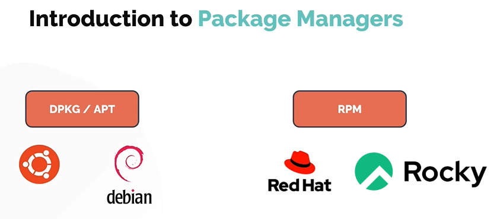
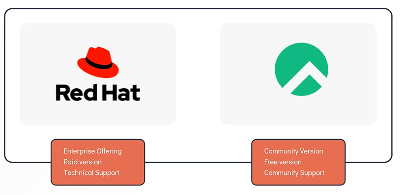

[HOME](../../README.md) | 03: Packet Management | 01: Packet Management Distributionen
---
# Paketverwaltungsverteilung

In diesem Abschnitt werfen wir einen Blick auf die Linux-Paketverwaltungstools, die in verschiedenen Linux-Distributionen verwendet werden
- Beginnt mit der Einführung in die Paketverwaltung.

## Einführung in Paketmanager

Für **`Debain/Ubuntu`** ist es **`apt/dpkg`** und für Rocky/Redhat ist es **`RPM`**

**Frage** : Was ist der Unterschied zwischen **`Rocky`**, **`RHEL`** und **`Ubuntu`***?
- Heutzutage werden Hunderte von Linux-Distributionen verwendet

Eine der üblichen Methoden zur Kategorisierung von Linux-Distributionen ist der verwendete Paketmanager.
- Zum Beispiel: Distributionen wie **`RHEL`**, **`Fedora`** und **`Rocky`**. basieren auf der Drehzahl. Daher sind sie als **`RPM`**-basierte Verteilung bekannt. Die **`Debian`**-Familie einschließlich **`Ubuntu`**, **`Debian`** und **`Linux Mint`** usw. Verwenden Sie **`Debian`**-basierte Paketmanager wie das **`DPKG`**.

#### Vergleichen wir nun die Betriebssysteme **`RHEL`** und **`Rocky`**.

#### Was ist ein Paket?
- Ein Paket in seiner einfachsten Definition ist ein komprimiertes Archiv, das alle Dateien enthält, die von einer bestimmten Software zum Ausführen benötigt werden.
- Zum Beispiel: Betrachten wir ein Ubuntu-System, wir möchten ein einfaches Bearbeitungssystem wie **`vim`** installieren, was für **`Vi IMproved`** steht. Dazu können wir das Paket [**`vim.deb`**](http://ports.ubuntu.com/pool/main/v/vim/vim_8.2.3995-1ubuntu2_arm64.deb) verwenden, das alle Software-Binärdateien und -Dateien enthält, die zum Ausführen des Bildeditors benötigt werden, zusammen mit den Metadaten, die die Informationen über die Software selbst liefern.

#### Das scheint ein ganz einfacher Prozess zu sein, warum machen wir das nicht die ganze Zeit? Laden Sie ein Paket herunter und installieren Sie es auf einem Linux-Server. Fragen Sie sich, was Paketmanager brauchen?
- Es gibt Hunderte von Linux-Distributionen, diese Distributionen führen unterschiedliche Sätze von Tools und Bibliotheken, Software und möglicherweise sogar unterschiedliche Linux-Kernel aus, was dazu führt, dass ein Linux-Programm möglicherweise nicht auf die gleiche Weise von einem System zum anderen ausgeführt wird. Um dieses Problem zu beheben, enthalten Pakete ein Manifest von Abhängigkeiten oder eine Liste von Programmen in Versionen, die erfüllt sein müssen, damit die Paketsoftware auf einem bestimmten Computer ordnungsgemäß ausgeführt wird.
- Sehen Sie sich die Fehler in der Installation an, während Sie versuchen, **`vim.deb`** auf diesem Ubuntu 22.04-System zu installieren. Die Abhängigkeiten sind fehlgeschlagen, da die Installationen fehlgeschlagen sind. Denken Sie daran, dass jedes dieser abhängigen Pakete eigene Abhängigkeiten haben kann, was die Paketinstallationsverwaltung zu einem sehr langwierigen Prozess macht. Hier kommt ein **`Package Manager`** ins Spiel.

   

#### Ein Paketmanager ist eine Software in einem Linux-System, die den konsistenten und automatisierten Prozess zum Installieren, Aktualisieren, Konfigurieren und Entfernen von Paketen aus dem Betriebssystem bereitstellt.

## Funktionen des Paketmanagers

## Arten von Paketmanagern

Eine Linux-Distribution unterstützt verschiedene Arten von Paketmanagern, einige der gebräuchlichsten sind unten aufgeführt

---
[BACK](../02-Linux-Core-Konzepre/07-Filesystem-Hierarchie.md) | [NEXT](./02-RPM-und-YUM.md)
