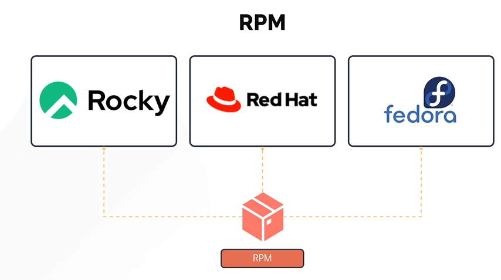
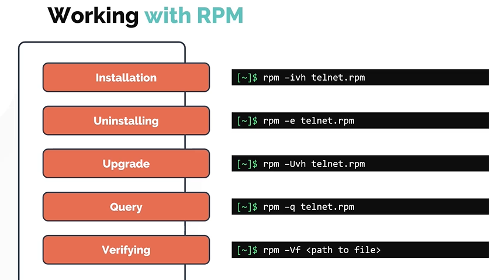
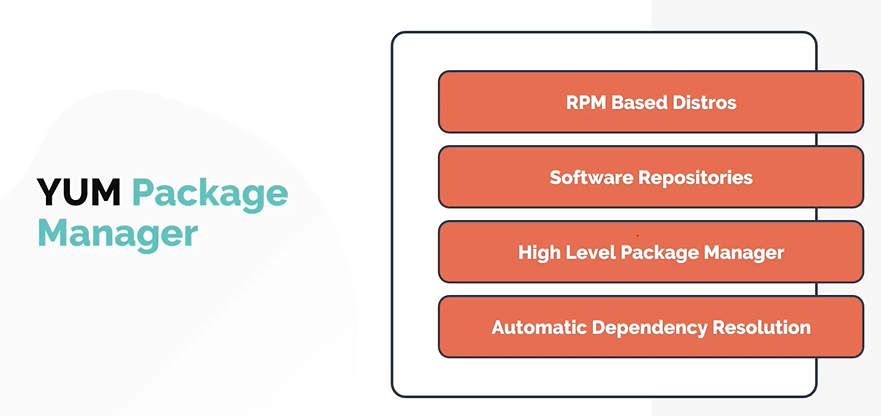
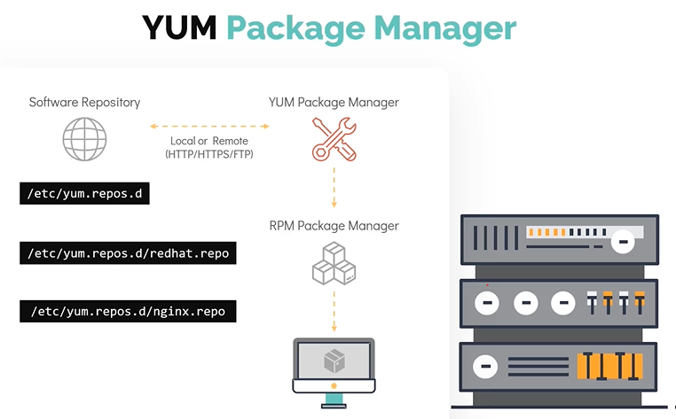
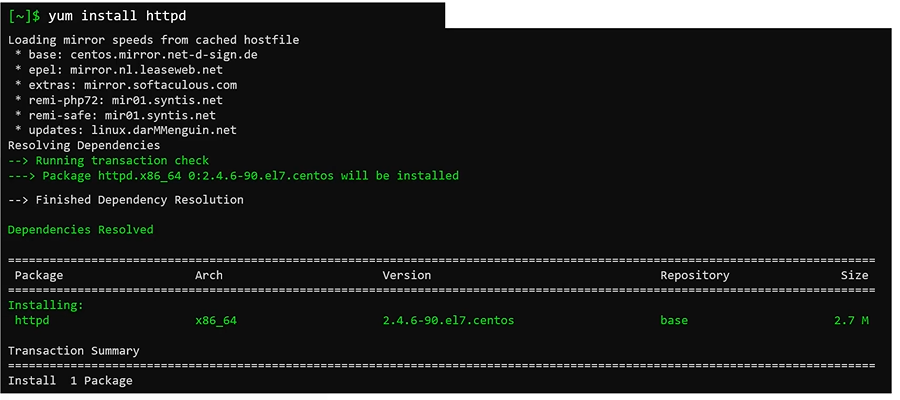
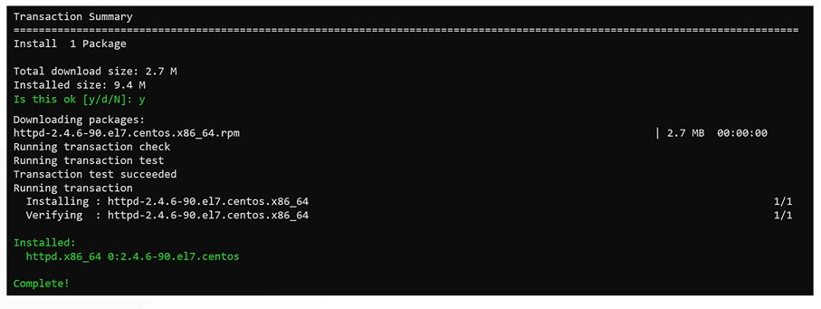
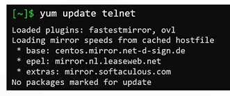

[HOME](../../README.md) | 03: Packet Management | 02: RPM und YUM
---
# RPM und YUM Packet Manager

In diesem Abschnitt werden wir uns die Paketmanager **`RPM`** und **`YUM`** im Detail ansehen.
- RPM
- YUM

## RPM (Redhat Package Manager)

Dieser Paketmanager wird sowohl in RHEL als auch in anderen Linux-Distributionen verwendet, aber dies sind die häufigsten. Die Dateierweiterung für von RPM verwaltete Pakete ist **`.RPM`**



#### Arbeiten mit RPM

RPM hat fünf grundlegende Betriebsmodi. Jeder dieser Modi kann mit dem Befehl **`rpm`** gefolgt von einem bestimmten Befehl **`options`** ausgeführt werden. Trotzdem löst RPM Abhängigkeiten nicht selbst auf. Aus diesem Grund verwenden wir eine höhere Ebene des Paketmanagers namens **`YUM`**.
1. Installing
1. Uninstalling
1. Upgrade
1. Query
1. Verfiying



## YUM (Yellowdog Updater Modifier)

YUM ist ein kostenloser Open-Source-Paketmanager.
- Funktioniert auf RPM-basierten Linux-Systemen
- Arbeitet mit Software-Repositories, die im Wesentlichen eine Sammlung von Paketen sind, und bietet Paketunabhängigkeitsverwaltung auf RPM-basierten Distributionen. Die Repository-Informationen werden in **`/etc/yum.repos.d/`** gespeichert und Repository-Dateien haben die Erweiterung **`.repo`**.
- Fungiert als High-Level-Paketmanager, aber unter der Haube hängt es immer noch von **`RPM`** ab, um Pakete auf den Linux-Systemen zu verwalten.
- Im Gegensatz zu RPM handhabt YUM Paketabhängigkeiten sehr gut (Automatic Dependency Resolution). Es ist in der Lage, alle Abhängigkeitspakete zu installieren, um das Basispaket auf dem Linux-System zu installieren.



#### Schauen wir uns an, wie YUM ein Paket installiert.



#### Werfen wir nun einen Blick auf die Abfolge der Schritte, die während der Installation des Pakets ausgeführt werden.
- Sobald yum ausgeführt wird, wird der Befehl **`yum install`** ausgegeben, YUM führt zuerst eine Transaktionsprüfung durch, wenn das Paket nicht im System installiert ist, überprüft yum die konfigurierten Repositories unter **`/etc/yum.repos.d/`* * für die Verfügbarkeit des angeforderten Pakets.
- Es prüft auch, ob abhängige Pakete bereits im System installiert sind oder ob ein Upgrade erforderlich ist.



- Nach diesem Schritt wird die Transaktionszusammenfassung auf dem Bildschirm angezeigt, damit der Benutzer sie überprüfen kann. Wenn wir mit der Installation fortfahren möchten, geben Sie die Schaltfläche **`y`** ein (dieser Schritt kann übersprungen werden, indem Sie das **`-y `**-Flag mit dem Befehl **`yum install`**).
- Yum lädt die erforderlichen RPMs herunter und installiert sie auf dem Linux-System



Wenn Sie ein einzelnes Paket aktualisieren möchten, verwenden Sie den Befehl **`yum update`**. Wenn sich das Paket bereits in der neuesten Version im Repository befindet und daher keine Aktion ausgeführt wird



#### Allgemeine Befehle

Um alle Repos aufzulisten, die Ihrem System hinzugefügt wurden. Führen Sie **`yum repolist`** aus
```
$ yum repolist
```

Um zu überprüfen, welches Paket installiert werden sollte, damit ein bestimmter Befehl funktioniert. Verwenden Sie den Befehl **`yum provided`** gefolgt von <Befehl> name.
```
$ yum provides scp
```

So installieren Sie ein Paket
```
$ yum install httpd
```

Um ein Paket zu installieren, wird jede Frage während des Vorgangs automatisch mit „Ja“ beantwortet. Verwenden Sie das Flag **`-y`** mit dem Befehl **`yum install`**.
```
$ yum install httpd -y
```
So entfernen Sie ein Paket
```
$ yum remove httpd
```
Um ein Paket zu aktualisieren
```
$ yum update telnet
```
Um alle Pakete im System zu aktualisieren, verwenden Sie den Befehl **`yum update`** ohne Argumente.
```
$ yum update
```
---
[BACK](./01-Packet-Management-Distributionen.md) | [NEXT](./03-Lab-RPM-und-YUM.md)
