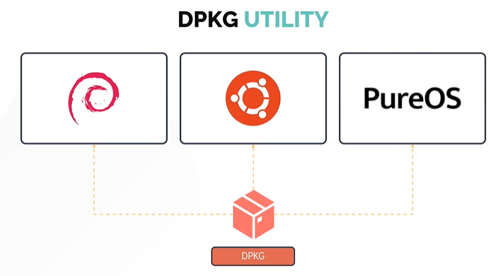
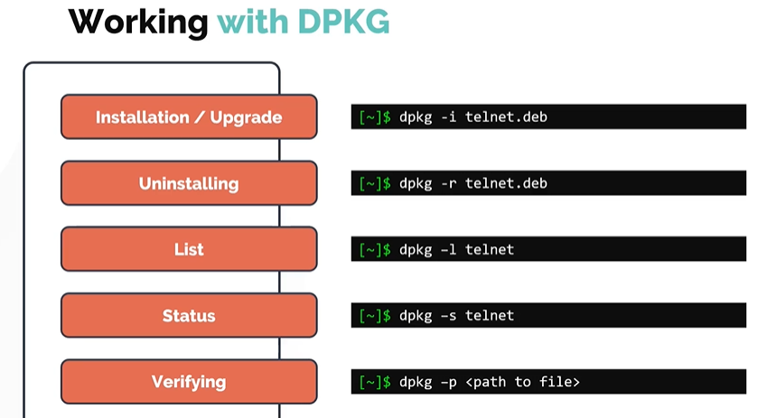

[HOME](../../README.md) | 03: Paket Management | 04: DPKG und APT
---
# DPKG- und APT-Paketmanager

In diesem Abschnitt betrachten wir Debian-Paketmanager für Distributionen wie **`Ubuntu`**, **`Debian`** und **`PureOS`**.
- DPKG
- APT

## DPKG-Dienstprogramm

- DPKG steht für Debian Package Manager
- Es ist ein Low-Level-Paketmanager



#### Arbeiten mit DPKG

Ähnlich wie RPM kann DPKG für Folgendes verwendet werden. Die Paketerweiterung ist .deb.
1. Installieren
1. Deinstallieren
1. Aktualisieren
1. Liste
1. Zustand
1. Verifizierung



## APT und APT-GET

Ähnlich wie RPM löst DPKG die Abhängigkeiten bei der Paketverwaltung nicht auf.
- Die Installation kann aufgrund von Abhängigkeitsproblemen fehlschlagen. Aus diesem Grund verwenden wir höherwertige Debian-Paketmanager wie **`APT`** und **`APT-GET`**.


- Anstatt sich auf DPKG zu verlassen, können Sie Software zusammen mit ihren Abhängigkeiten mit **`APT`** oder **`APT-GET`** installieren.
- **`APT`** oder **`APT-GET`** klingen zwar ähnlich, hängen aber nicht voneinander ab.
- **`APT`** steht für Advanced Package Manager, es ist benutzerfreundlicher und insgesamt ein besseres Tool im Vergleich zu **`APT-GET`**.
   ```
   $sudo apt install vim
   $sudo apt-get install vim
   ```

- APT fungiert als Frontend-Paketmanager, der sich auf das DPKG-Dienstprogramm stützt. Ähnlich wie YUM stützt sich APT auf ein Software-Repository, das Pakete enthält, die schließlich auf einem System installiert werden.
- Das Software-Repository für APT ist in der Datei **`/etc/apt/sources.list`** definiert, oder als seperatei Repositorie Dateien in **`/etc/apt/sources.list.d/`** hinterlegt.


#### Lassen Sie uns wissen, um einige allgemeine Befehle zu sehen

So aktualisieren Sie ein Repository. Führen Sie den Befehl **`apt update`** aus.
```
$ sudo apt-update
```

Um verfügbare Upgrades aller derzeit auf dem System installierten Pakete aus den konfigurierten Quellen zu installieren.
```
$ sudo apt-upgrade
```

Eine andere Möglichkeit, das Repository zu aktualisieren, ist die Verwendung des Befehls **`apt edit-sources`**. Dadurch wird die Datei **`/etc/apt/sources.list`** im Texteditor Ihrer Wahl geöffnet.
```
$ sudo apt edit-sources
```

Um das Paket zu installieren
```
$ sudo apt install telnet
```

Um das Paket zu entfernen
```
$ sudo apt remove telnet
```

Um ein Paket im Repository zu suchen oder zu suchen.
```
$ sudo apt search telnet
```

Um alle verfügbaren Pakete aufzulisten
```
$ sudo apt list | grep telnet
```

Um alle installierten Pakete anzuzeigen
```
$ apt list --installed
```
---
[BACK](./03-Lab-RPM-und-YUM.md) | [NEXT](./05-APT-vs-APT-GET.md)
