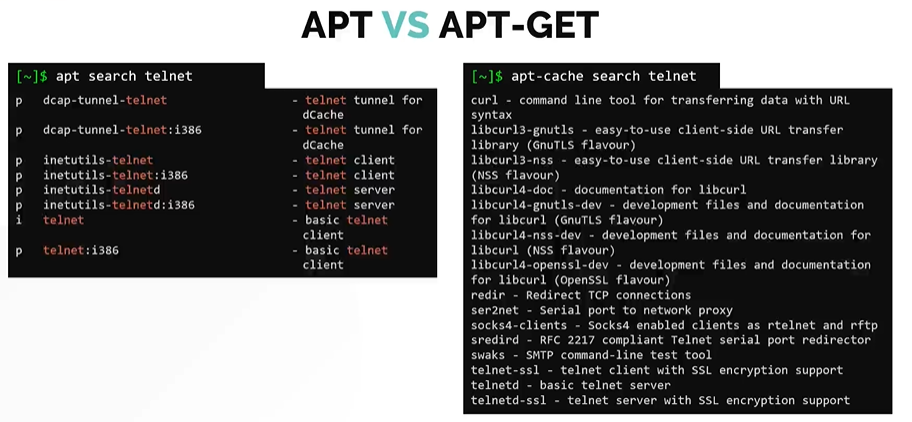

[HOME](../../README.md) | 03: Paket Management | 05: APT vs APT-GET
---
# APT gegen APT-GET

#### Unterschied zwischen APT und APT-GET
- APT ist im Vergleich zu APT-GET ein benutzerfreundlicheres Tool
- In allen aktuellen Debian-basierten Distributionen ist APT bereits standardmäßig installiert.

#### Schauen wir uns an, warum **`APT`** im Vergleich zu **`APT-GET`** besser ist

Versuchen wir, das Paket **`firefox`** mit APT und APT-GET zu installieren
- Sie werden feststellen, dass APT die Augen schont, Sie erhalten gerade genug Informationen und auch einen netten kleinen Fortschrittsbalken
- APT-GET ist nur effektiv und liefert die Ausgabe nicht in einem benutzerfreundlichen Format.


Lassen Sie uns einen anderen Vergleich versuchen, indem wir ein **`telent`**-Paket suchen.
- Sie werden feststellen, dass sich bei apt alle Optionen an einem Ort befinden. Sie können mit dem Befehl **`apt search telnet`** suchen.
- Andererseits können Sie den Suchbefehl nicht mit dem Befehl **`apt-get`** verwenden. Stattdessen müssen Sie ein anderes Tool namens **`apt-cache search telnet`** verwenden.
- Wenn Sie die Ergebnisse der beiden Befehle vergleichen, werden Sie auch sehen, dass der **`apt-cache`** viele zusätzliche Informationen in das Suchergebnis einwirft, die für den Endbenutzer möglicherweise nicht wirklich nützlich sind.



#### Wrapper für Apt

Mittlerweile existieren auch sogenannte Wrapper für Apt, welche eine bessere Benutzererfahrung und ein leichteres Handling für Apt bereitstellen.

In der Shell ZSH wird ein Module bereit gestellt welches die arbeit mit APT erleichtern soll.
```
$ aguu = apt -y update; apt -y upgrade
$ agar = apt -y autoremove
$ agc = apt -y autoclean
```

Oder die freie Software Nala, welche optisch sehr an YUM erinnert, jedoch für Apt den vorteil beitet, das die Repositories sowie die einzelnen Pakete nicht Sequentiel sondern parallel heruntergeladen werden, wodurch zeit gespaart werden kann, sowie eine History der installierten Pakete.

(https://gitlab.com/volian/nala)
---
[BACK](./04-DPKG-und-APT.md)
